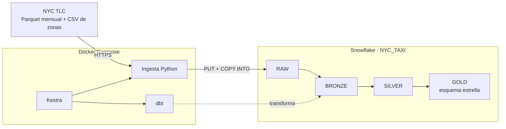

# Laboratorio Integrador 1: tubería ELT de NYC Yellow Taxi

Tubería ELT reproducible que **ingiere** automáticamente los viajes de NYC
Yellow Taxi (enero 2025 a agosto 2026), los **carga** en Snowflake y los
**transforma** con dbt en una arquitectura **Bronze → Silver → Gold** que
termina en un esquema estrella listo para el análisis. Kestra la orquesta y
Docker Compose levanta toda la infraestructura local.

## Resultado

Última ejecución completa: 28 de septiembre de 2026.

| Capa | Objeto | Filas |
|---|---|---:|
| RAW / Bronze | Viajes de 19 archivos mensuales (2025-01 a 2026-07) | 75,089,241 |
| RAW / Bronze | Zonas de taxi | 265 |
| Silver | Viajes limpios (`silver_yellow_trips`) | 71,984,458 |
| Silver | Cuarentena (`silver_yellow_trips_rejected`) | 3,104,783 (4.1%) |
| Gold | Tabla de hechos (`fct_trips`) | 71,984,458 |
| Gold | Calendario (`dim_date`, 2025-01-01 a 2026-08-01) | 578 |

- **Agosto 2026:** al 28 de septiembre de 2026 TLC aún no lo publica (publica
  con unos dos meses de retraso). La ingesta lo registra como `NOT_AVAILABLE`,
  y la ejecución automática de cada lunes lo cargará cuando aparezca, sin
  duplicar nada.
- **dbt build:** 103 nodos (13 modelos, 3 seeds y 87 pruebas), 0 errores, unos
  2.5 minutos.

## Arquitectura



- Diagrama completo y descripción de cada componente:
  [`docs/arquitectura.md`](docs/arquitectura.md).
- Diagrama del esquema estrella con grano, llaves y métricas:
  [`docs/esquema_estrella.md`](docs/esquema_estrella.md).

| Pieza | Tecnología | Versión |
|---|---|---|
| Infraestructura local | Docker Compose | — |
| Orquestador | Kestra (backend Postgres 17) | 1.3.37 |
| Data warehouse | Snowflake (warehouse XSMALL) | — |
| Ingesta | Python + snowflake-connector-python | 3.12 / 4.7.5 |
| Transformaciones y pruebas | dbt-core + dbt-snowflake | 1.12.5 / 1.12.1 |

## Estructura del repositorio

```
semana-07/
├── README.md
├── docker-compose.yml              infraestructura: Kestra + Postgres
├── .env.example                    plantilla de configuración (copiar a .env)
├── infra/
│   ├── kestra/                     Dockerfile y requirements de la imagen de Kestra
│   └── snowflake/
│       ├── 00_bootstrap_admin.sql  rol, warehouse, base y usuario de servicio (una vez)
│       ├── 01_objetos_raw.sql      esquemas, stages y tablas RAW (lo ejecuta el pipeline)
│       └── 99_reset_pipeline.sql   borra las capas para probar desde cero
├── scripts/
│   ├── generar_llaves.sh           crea el par de llaves RSA y prepara el bootstrap
│   └── probar_conexion.py          prueba la conexión con la llave
├── ingesta/
│   ├── conexion.py                 conexión a Snowflake con par de llaves
│   ├── crear_objetos_raw.py        ejecuta 01_objetos_raw.sql
│   └── ingestar_tlc.py             descarga y carga a RAW, sin duplicar
├── flows/
│   └── main_nyc_taxi.pipeline_nyc_taxi.yml   flujo de Kestra
├── dbt/
│   ├── dbt_project.yml, profiles.yml
│   ├── macros/                     nombres de esquemas y llave de fecha
│   ├── seeds/                      catálogos del diccionario de TLC
│   ├── models/bronze|silver|gold/  modelos y sus pruebas (.yml)
│   └── tests/                      pruebas de conciliación y reglas
├── analisis/
│   └── 01_perfilado_bronze.sql     perfilado que justifica la limpieza
└── docs/
    ├── arquitectura.md
    ├── esquema_estrella.md
    └── decisiones_de_limpieza.md
```

## Cómo levantar y ejecutar desde cero

### Requisitos

- Linux o macOS con **Docker** y **Docker Compose** (`docker compose version`),
  **git** y **openssl**.
- Una cuenta de **Snowflake** con acceso al rol `ACCOUNTADMIN`. Sirve una
  cuenta de prueba gratuita.
- Unos 10 GB libres de disco y 4 GB de RAM para Docker.

### 1. Clonar el repositorio

```bash
git clone <url-del-repositorio>
cd <repositorio>/laboratorios/semana-07
```

### 2. Configurar la conexión

```bash
cp .env.example .env
```

Edita `.env` y pon en `SNOWFLAKE_ACCOUNT` el identificador de tu cuenta. Lo
obtienes en Snowsight con:

```sql
SELECT CURRENT_ORGANIZATION_NAME() || '-' || CURRENT_ACCOUNT_NAME();
```

### 3. Crear las llaves del usuario de servicio

```bash
bash scripts/generar_llaves.sh
```

Esto crea `keys/rsa_key.p8` (llave privada, nunca se sube a git) y
`keys/rsa_key.pub`. También genera `keys/00_bootstrap_listo.sql`: el script de
bootstrap con tu llave pública ya insertada.

### 4. Preparar Snowflake (una sola vez)

1. En Snowsight, abre una hoja SQL nueva y pega el contenido de
   `keys/00_bootstrap_listo.sql`.
2. Ejecútalo completo con **Run All**.

El script crea el rol `NYC_TAXI_ROLE`, el warehouse `NYC_TAXI_WH` (XSMALL, se
apaga solo a los 60 s), la base `NYC_TAXI` y el usuario de servicio
`NYC_TAXI_SVC`. Es idempotente, así que re-ejecutarlo no rompe nada.

Opcionalmente, prueba la conexión:

```bash
docker run --rm --env-file .env -v "$PWD/keys:/keys:ro" -v "$PWD/scripts:/scripts:ro" \
  python:3.12-slim bash -c "pip install -q snowflake-connector-python && python /scripts/probar_conexion.py"
```

### 5. Levantar la infraestructura

```bash
docker compose up -d --build
docker compose ps        # kestra y kestra-db en estado running
```

La primera vez tarda entre 5 y 10 minutos, porque construye la imagen de
Kestra con Python y dbt.

### 6. Ejecutar la tubería

1. Abre http://localhost:8080. El flujo `pipeline_nyc_taxi` del namespace
   `nyc_taxi` se carga solo desde la carpeta `flows/`.
2. Presiona **Execute** con los valores por defecto.

La primera ejecución descarga y carga los 20 meses (unos 7 minutos) y luego
construye y prueba las tres capas (unos 3 minutos).

### 7. Verificar en Snowsight (rol SYSADMIN)

```sql
SHOW SCHEMAS IN DATABASE NYC_TAXI;                          -- RAW, BRONZE, SILVER, GOLD

SELECT source_file, status, rows_loaded, message             -- bitácora de la ingesta
FROM NYC_TAXI.RAW.INGESTION_LOG
ORDER BY finished_at DESC;

SELECT COUNT(*) FROM NYC_TAXI.GOLD.FCT_TRIPS;                -- viajes listos para análisis
```

Para repetir la prueba **desde cero** en cualquier momento:

1. Ejecuta `infra/snowflake/99_reset_pipeline.sql`. Borra las cuatro capas.
2. Vuelve a ejecutar el flujo.

## El flujo en Kestra

| # | Tarea | Qué hace |
|---|---|---|
| 1 | `verificar_conexion` | Prueba que el usuario de servicio entra con su llave |
| 2 | `crear_objetos_raw` | Crea, si no existen, los esquemas, stages, formatos y tablas RAW |
| 3 | `ingestar_tlc` | Descarga y carga a RAW cada mes del rango; salta los que ya están cargados |
| 4 | `dbt_build` | `dbt build`: seeds, Bronze, Silver, Gold y las 87 pruebas, en orden de dependencias |

| Parámetro | Por defecto | Uso |
|---|---|---|
| `desde` / `hasta` | `2025-01` / `2026-08` | Rango de meses a cargar (AAAA-MM) |
| `forzar_recarga` | `false` | Recarga los meses aunque ya estén cargados |
| `dbt_full_refresh` | `false` | Reconstruye Bronze (incremental) desde cero |

**Ingesta automática:** el trigger `revision_semanal` ejecuta el flujo cada
lunes a las 06:00 (America/Guayaquil). Si TLC publicó un mes nuevo del rango,
se carga y se propaga a todas las capas. Si no, no cambia nada. Kestra debe
estar encendido para que se dispare.

## Capas de datos

| Capa | Esquema | Contenido | Materialización |
|---|---|---|---|
| RAW | `RAW` | Archivos originales en stages, tablas `YELLOW_TRIPS` y `TAXI_ZONES` tal como llegan, y bitácora `INGESTION_LOG` | Tablas cargadas por la ingesta |
| Bronze | `BRONZE` | Mismas columnas y valores que la fuente, más `_source_file`, `_source_period`, `_loaded_at` y `_bronze_loaded_at` | Incremental por archivo (`delete+insert`) |
| Silver | `SILVER` | Nombres `snake_case`, tipos correctos, nulos tratados, registros inválidos a cuarentena, duplicados eliminados, catálogos de TLC | Tablas reconstruidas en cada ejecución, más una vista de cuarentena |
| Gold | `GOLD` | Esquema estrella: `fct_trips` y `dim_date`, `dim_time`, `dim_zone`, `dim_vendor`, `dim_rate_code`, `dim_payment_type` | Tablas |

### Silver: decisiones de limpieza

Cada regla está justificada con el perfilado de los datos reales en
[`docs/decisiones_de_limpieza.md`](docs/decisiones_de_limpieza.md). En resumen:

- **Tipos y nombres:** montos en `NUMBER(18,2)` en lugar de `FLOAT`, indicador
  Y/N como booleano y nombres `snake_case` consistentes.
- **Nulos:** el 24.5% de los viajes son "Flex Fare" y no reportan pasajeros,
  tarifa ni algunos recargos. Se conservan. La tarifa nula pasa a 99, el código
  oficial de "desconocido", y el resto queda en `NULL`, sin inventar valores.
- **Registros inválidos:** van a cuarentena con su motivo. Son reversos con
  montos negativos, ajustes con tarifa negativa, llegada antes de la salida,
  más de 24 h, fuera del mes del archivo, sin movimiento, más de 200 millas y
  más de $1,000.
- **Valores imposibles en viajes reales:** pasajeros en 0 o más de 6, distancia
  0 y duración 0 pasan a `NULL`, y el viaje se conserva.
- **Duplicados:** un viaje por `trip_id` (proveedor + salida + llegada + zonas),
  con un criterio de desempate determinista. Los viajes cuyo cobro fue anulado
  se marcan con `has_reversal`.

Filas en cuarentena por motivo:

```sql
SELECT rejection_reason, COUNT(*) AS filas
FROM NYC_TAXI.SILVER.SILVER_YELLOW_TRIPS_REJECTED
GROUP BY 1
ORDER BY 2 DESC;
```

### Gold: esquema estrella

- **Grano de `fct_trips`:** un viaje válido y sin duplicados.
- **Primary key:** `trip_id`.
- **Foreign keys:** nueve, hacia seis dimensiones. Fecha, hora y zona son de
  rol múltiple: salida y llegada, origen y destino.
- **Métricas:** pasajeros, distancia, duración y cada componente del cobro.

Detalle completo en [`docs/esquema_estrella.md`](docs/esquema_estrella.md).

## Pruebas (dbt)

`dbt build` corre **87 pruebas** después de construir cada modelo. Si una
falla, lo que depende de ese modelo no se construye y la tarea de Kestra
falla.

| Tipo | Cantidad | Qué valida |
|---|---:|---|
| `not_null` | 53 | Llaves, fechas, montos y metadata obligatorios |
| `unique` | 15 | `trip_id` en Silver y Gold, primary key de cada dimensión y catálogo |
| `relationships` | 14 | Cada FK de `fct_trips` contra su dimensión, y los códigos de Silver contra los catálogos de TLC |
| `accepted_values` | 1 | Motivos de rechazo válidos |
| Conciliación RAW → Bronze | 1 | Mismas filas por archivo en RAW y Bronze |
| Conciliación Bronze → Silver | 1 | Bronze = Silver + cuarentena (no se pierde ni se inventa nada) |
| Reglas de Silver | 1 | Ningún viaje limpio incumple una regla de calidad |
| Conciliación Silver → Gold | 1 | Mismos viajes y mismo monto total en `fct_trips` |

## Idempotencia: re-ejecutar sin duplicados

| Capa | Cómo se garantiza | Evidencia |
|---|---|---|
| RAW | Por archivo: `DELETE` de sus filas + `COPY INTO` en una transacción. Un mes ya cargado y sin cambios se salta (`SKIPPED`) | Re-ejecución: 19 meses `SKIPPED`. Recarga forzada de 2025-02: 3,577,543 filas antes y después |
| Bronze | Incremental por archivo: solo procesa lo que llegó a RAW después de la última carga y reemplaza las filas de ese archivo | Re-ejecución: 0 filas nuevas. La conciliación RAW → Bronze pasa |
| Silver y Gold | Se reconstruyen completos en cada ejecución con reglas deterministas | Dos ejecuciones dan exactamente los mismos conteos |
| Snowflake | Todos los objetos se crean con `IF NOT EXISTS` | Re-ejecutar los scripts no da errores |

## Solución de problemas

| Síntoma | Causa y solución |
|---|---|
| El puerto 8080 está ocupado | Otro Kestra o servicio está corriendo. Revisa con `docker ps` y apágalo |
| El flujo no aparece en Kestra | Ejecuta `touch flows/*.yml` para que Kestra lo vuelva a leer |
| `JWT token is invalid` | La llave pública registrada en Snowflake no corresponde a `keys/rsa_key.p8`. Vuelve a ejecutar `keys/00_bootstrap_listo.sql` |
| Un mes reciente sale `NOT_AVAILABLE` | Es normal: TLC aún no lo publica. Se cargará en la próxima ejecución |
| Un mes antiguo sale `FAILED` | TLC no respondió (red o bloqueo). Re-ejecuta el flujo: solo reintenta lo que falta |

## Apagar y limpiar

```bash
docker compose down        # apaga Kestra; conserva su historial
docker compose down -v     # apaga Kestra y borra su historial
```

En Snowflake, `infra/snowflake/99_reset_pipeline.sql` borra las capas del
pipeline. El warehouse se suspende solo, así que no consume créditos mientras
no se use.
