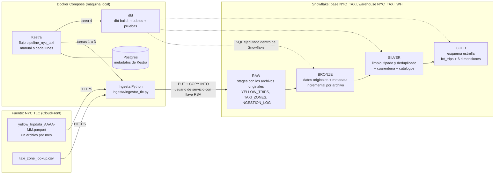

# Arquitectura

## Componentes

| Componente | Qué hace | Dónde está |
|---|---|---|
| **NYC TLC** | Publica un Parquet de viajes por mes (con unos dos meses de retraso) y el catálogo de zonas | `https://d37ci6vzurychx.cloudfront.net` |
| **Docker Compose** | Levanta la infraestructura local: Kestra y su base Postgres | `docker-compose.yml` |
| **Imagen de Kestra** | Kestra oficial + Python con el conector de Snowflake y dbt, en versiones fijas | `infra/kestra/` |
| **Kestra** | Orquesta la tubería: ejecuta las tareas en orden, guarda los logs y la dispara cada lunes | `flows/` |
| **Ingesta** | Descarga cada archivo, lo sube al stage (archivo original) y lo copia a RAW con metadata, sin duplicar | `ingesta/` |
| **Snowflake** | Almacena y procesa todas las capas | `infra/snowflake/` |
| **dbt** | Transforma RAW en Bronze, Silver y Gold dentro de Snowflake y corre las pruebas | `dbt/` |

## Flujo de datos (ELT)

1. **Extract:** la ingesta descarga los archivos originales de TLC.
2. **Load:** los sube sin modificar al stage interno y los copia a las tablas
   RAW. `COPY INTO` agrega el archivo de origen y la fecha de carga.
3. **Transform:** dbt transforma los datos **dentro de Snowflake** en tres capas:
   - **Bronze:** mismos datos que la fuente, más el período de origen y la
     fecha de carga.
   - **Silver:** datos limpios según las reglas de `docs/decisiones_de_limpieza.md`.
     Lo rechazado queda en cuarentena, no se borra.
   - **Gold:** esquema estrella listo para análisis (`docs/esquema_estrella.md`).

## Seguridad

- El pipeline no usa contraseñas. Se conecta con un **usuario de servicio**
  (`NYC_TAXI_SVC`, `TYPE = SERVICE`) que se autentica con un **par de llaves
  RSA**. Snowflake bloquea desde 2026 el inicio de sesión solo con contraseña.
- El usuario usa un rol propio (`NYC_TAXI_ROLE`) con los permisos mínimos:
  usar el warehouse y crear esquemas en la base `NYC_TAXI`.
- La llave privada (`keys/`) y el archivo `.env` están en `.gitignore` y
  nunca se suben al repositorio.
