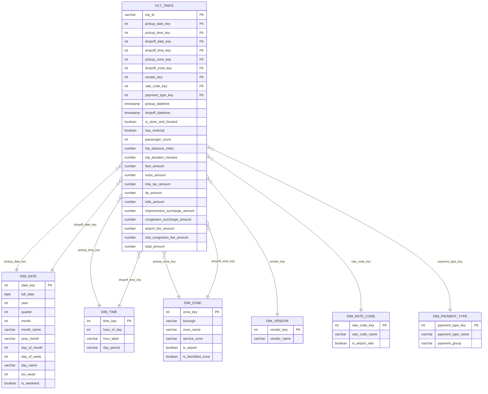

# Esquema estrella (capa Gold)

Modelo dimensional para analizar los viajes de NYC Yellow Taxi desde distintas
perspectivas: cuándo (fecha y hora), dónde (zona de origen y destino), quién
(proveedor), cómo se cobró (tarifa) y cómo se pagó (forma de pago).



## Tabla de hechos: `fct_trips`

**Grano:** un viaje de taxi válido y sin duplicados. Es una fila por
`trip_id` y viene de `silver_yellow_trips`. Se eligió el grano más fino porque
permite responder cualquier pregunta agregando (por día, zona, hora, etc.) sin
perder detalle.

**Primary key:** `trip_id`, un hash MD5 de proveedor, salida, llegada, zona de
origen y zona de destino. Las pruebas `unique` y `not_null` la validan.

**Foreign keys:**

| Llave foránea | Dimensión | Rol |
|---|---|---|
| `pickup_date_key` | `dim_date` | Fecha de salida |
| `dropoff_date_key` | `dim_date` | Fecha de llegada |
| `pickup_time_key` | `dim_time` | Hora de salida |
| `dropoff_time_key` | `dim_time` | Hora de llegada |
| `pickup_zone_key` | `dim_zone` | Zona de origen |
| `dropoff_zone_key` | `dim_zone` | Zona de destino |
| `vendor_key` | `dim_vendor` | Proveedor |
| `rate_code_key` | `dim_rate_code` | Tarifa aplicada |
| `payment_type_key` | `dim_payment_type` | Forma de pago |

Cada llave foránea tiene pruebas `not_null` y `relationships`.

`dim_date`, `dim_time` y `dim_zone` son **dimensiones de rol múltiple**: una
sola tabla que la tabla de hechos usa dos veces con significados distintos
(salida y llegada; origen y destino).

**Métricas:**

- **Aditivas**, se pueden sumar en cualquier dimensión: `fare_amount`,
  `extra_amount`, `mta_tax_amount`, `tip_amount`, `tolls_amount`,
  `improvement_surcharge_amount`, `congestion_surcharge_amount`,
  `airport_fee_amount`, `cbd_congestion_fee_amount`, `total_amount`,
  `trip_distance_miles`, `trip_duration_minutes` y `passenger_count`. El
  número de viajes se obtiene con `COUNT(*)`.
- **Derivadas**, se calculan en la consulta y no se guardan porque no son
  aditivas: velocidad promedio (distancia / duración), propina como porcentaje
  de la tarifa y monto promedio por viaje.

**Atributos del viaje** (dimensiones degeneradas): `pickup_datetime`,
`dropoff_datetime`, `is_store_and_forward` y `has_reversal`. Esta última
permite excluir de los análisis de ingresos los viajes cuyo cobro fue anulado.

## Dimensiones

| Dimensión | Grano | Primary key | Origen | Atributos |
|---|---|---|---|---|
| `dim_date` | Un día | `date_key` (AAAAMMDD) | Generada desde la primera salida hasta la última llegada | año, trimestre, mes, nombre del mes, día, día de la semana, semana ISO, fin de semana |
| `dim_time` | Una hora del día (0-23) | `time_key` | Generada | etiqueta de la hora, franja del día (madrugada, mañana, tarde, noche) |
| `dim_zone` | Una zona de TLC | `zone_key` (LocationID) | `silver_taxi_zones` | distrito, zona, tipo de zona de servicio, es aeropuerto, zona identificada |
| `dim_vendor` | Un proveedor | `vendor_key` | Seed `ref_vendors` | nombre |
| `dim_rate_code` | Un código de tarifa | `rate_code_key` | Seed `ref_rate_codes` | nombre, es tarifa de aeropuerto |
| `dim_payment_type` | Una forma de pago | `payment_type_key` | Seed `ref_payment_types` | nombre, grupo de pago |

**Decisión sobre las llaves de las dimensiones:** las dimensiones de catálogo
usan como primary key el **código oficial de TLC** (LocationID, VendorID,
RatecodeID, payment_type) en lugar de una llave artificial. Son códigos
estables, definidos en el diccionario de datos, y así la tabla de hechos queda
más liviana y fácil de consultar. `dim_date` usa una llave inteligente
AAAAMMDD, legible y ordenable.

## Ejemplo de consulta

Ingresos y viajes por distrito de origen y franja del día, en días laborables
y sin viajes con cobro anulado:

```sql
SELECT z.borough,
       t.day_period,
       COUNT(*)                            AS viajes,
       SUM(f.total_amount)                 AS ingresos_usd,
       ROUND(AVG(f.trip_distance_miles), 2) AS distancia_promedio
FROM NYC_TAXI.GOLD.FCT_TRIPS f
JOIN NYC_TAXI.GOLD.DIM_ZONE z ON f.pickup_zone_key = z.zone_key
JOIN NYC_TAXI.GOLD.DIM_TIME t ON f.pickup_time_key = t.time_key
JOIN NYC_TAXI.GOLD.DIM_DATE d ON f.pickup_date_key = d.date_key
WHERE NOT d.is_weekend
  AND NOT f.has_reversal
GROUP BY 1, 2
ORDER BY ingresos_usd DESC;
```
